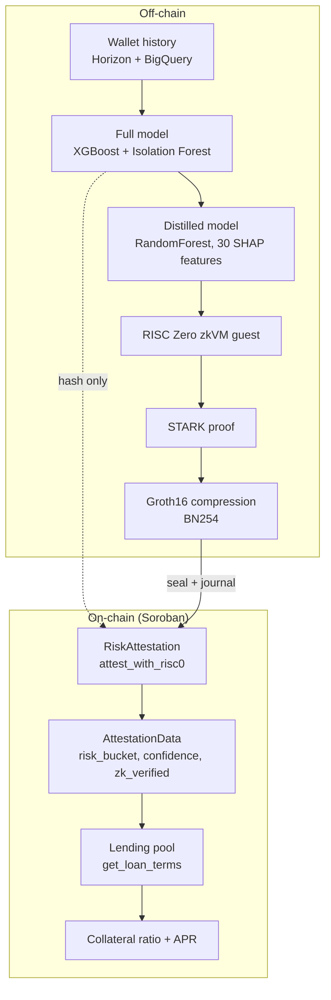

# How It Works

An attestation moves through four stages: score, prove, publish, and consume. Each stage is owned by a different layer of the system.

## 1. Score

A request comes in for a Stellar address. The backend pulls that wallet's transaction history from Horizon (and BigQuery's `crypto_stellar` dataset as a secondary source), extracts a behavioral feature vector, and scores it with the full model: an XGBoost classifier plus Isolation Forest anomaly detection, calibrated with Platt scaling. This produces a risk bucket (`VERY_LOW` through `VERY_HIGH`) and a confidence score in basis points.

See [ML Pipeline](/architecture/ml-pipeline) for the feature families and model details.

## 2. Prove

The full model is too large to prove in a zkVM directly, so a distilled model (a RandomForest trained via teacher-student distillation on the top 30 SHAP-selected features from the full model) reruns the same inference inside a RISC Zero zkVM guest. That execution is proven as a STARK, then compressed into a Groth16 (BN254) receipt: a `seal` and a `journal` of public outputs.

See [ZK Proof Layer](/architecture/zk-proof-layer) for the full proving workflow.

## 3. Publish

The API co-signs the proof and submits `seal`, `journal`, and the attestation payload to the `RiskAttestation` contract on Soroban. The contract verifies the Groth16 receipt on-chain against a whitelisted guest image ID, binds the proven fields (risk bucket, confidence, model hash), and sets `zk_verified = true`. If proving is unavailable, the system falls back to an explicitly labeled, hash-anchored attestation instead of blocking the user. See [On-Chain vs Off-Chain](/concepts/on-chain-vs-off-chain).

## 4. Consume

Any Stellar contract (a lending pool, an RWA protocol, any Soroban contract) can call `RiskAttestation::get_attestation(wallet)` and read the risk bucket, confidence, and `zk_verified` flag directly from chain state. This is a plain cross-contract call: no API key, no off-chain round trip. `MockLendingPool` in this repository is a reference implementation that prices collateral ratio and APR by risk bucket, and any protocol can copy that same read pattern into its own contract.

## The identity layer, in parallel

Separately from scoring, a wallet can register into a proof-gated identity group (Poseidon commitment, Circom to Groth16) to link multiple wallets under one identity, and bind a KYC nullifier so a lending protocol can require "one verified human, one credit identity" without ZKredit or the lender ever seeing raw KYC documents. See [Identity & Sybil Resistance](/concepts/identity-and-sybil-resistance).

## Diagram

